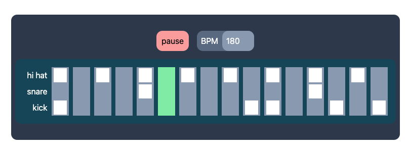

# Notes

## Setup

    - Blank PianoRoll
    - `Demo` && `AudioCtx` branches fully committed.

## Why

- I've always enjoyed messing around with music apps:

  - Notation software:
    - Sibelius by Avid
    - MuseScore, open-source
  - DAWs (Digital Audio Workstations):
    - FL Studio, previously known as FruityLoops
    - Ableton Live
    - Apple GarageBand

- Most of the code required will hopefully take place behind the scenes, that means very little CSS required! 😁

## Built with

- React
- TailWindCSS

## Showcase

- Start with a blank pianoRoll

  - Demonstrate preview sounds, clicking each track
  - Remove snare + kick
  - Click every other hi hat - filling out the loop

- Clicking the Play button sets a flag to start a `setInterval()` function which is responsible for advancing the playHead index and looping it back when it reaches the end of the track.

- Whenever the playHead index changes, each `Beat` component checks whether its own index matches the playHead index. If it does, it highlights itself and plays the audio sample it has been assigned.

- Because of this, this means I can add more notes to the pianoRoll and they will trigger the next time the playHead passes by it.
- Having the preview sound happen during playback would be annoying, so I turned that off.

- I can also change the Beats Per Minute (BPM) as well.

## Issues

- No audio scheduling. This means that I am at the whim of React to set the timing.
  - And it will sometimes do things slightly faster or shorter.
  - As evidenced by my console logs:
    - At a slow speed of 180 bpm the variance is only about 2% which isn't too noticeable.
    - The variance as a percentage only increases as the bpm increases however.
    - The variance is over 7% at 720bpm.
    - This means any rhythms more complicated than the example will require a re-think.
- Therefore, I need to make use of the [Web Audio API](https://developer.mozilla.org/en-US/docs/Web/API/Web_Audio_API) and using an audio context which will allow me to schedule playBack ahead of time. Which allows more much more intricate rhythms.
  - Load `AudioCtx` branch, and demonstrate trap beat.
